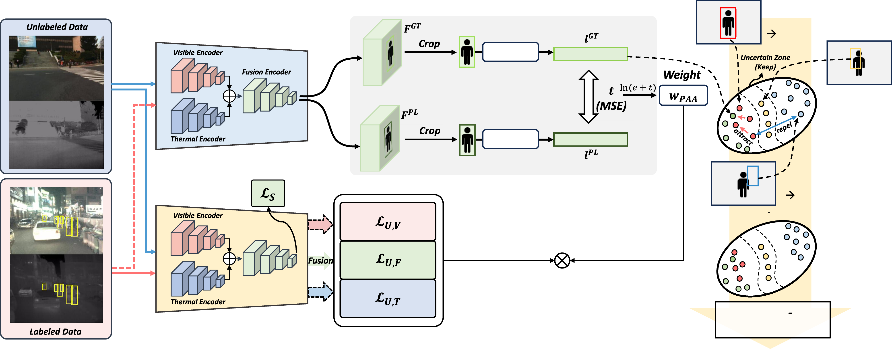

# SSMPD: Semi-Supervised Learning for Multispectral Pedestrian Detection

This repository is the pytorch implementation of our paper, SSMPD.

Published at [IEEE Transactions on Multimedia](https://ieeexplore.ieee.org/xpl/RecentIssue.jsp?punumber=6046), vol. 28, pp. 1806-1819, 2026:

[[Paper](https://doi.org/10.1109/TMM.2025.3645626)]

<a href="https://github.com/0v0V"><strong>Seungho Shin*</strong></a>
·
<a href="https://github.com/cksdlakstp12"><strong>Chan Lee*</strong></a>
·
<a href="https://scholar.google.com/citations?user=Sz6rfOMAAAAJ&hl=en"><strong>Gyeong-Moon Park</strong></a>📧
·
<a href="https://scholar.google.co.kr/citations?user=JMZ80R8AAAAJ&hl=en"><strong>Jung Uk Kim</strong></a>📧

(* and 📧 indicate equal contribution and corresponding authors, respectively)

<b>Kyung Hee University, Korea University</b>

<a></a>

_________________

## Abstract

Pedestrian detection is a crucial task in computer vision. Utilizing multispectral knowledge, especially, is essential to effectively detect the pedestrians. Existing multispectral pedestrian detection methods, however, perform only in fully-supervised situations. Although studies on semi-supervised object detection have been conducted, they focus only on single modality environments. Therefore, we propose novel semi-supervised multispectral pedestrian detector (SSMPD) that effectively utilizes multispectral knowledge. Our SSMPD consists of three methods that effectively address the pseudo-labels in the multispectral domain and a novel data selection method. First, we introduce a Pedestrian Appearance-Aware (PAA) weight to consider the quality of the pseudo-label by adjusting the multispectral knowledge transfer from the teacher model to the student model. Second, we propose a Unified Modal-Aware Simultaneous (UMAS) learning to consider the single modality (visible or thermal) and multispectral modalities when learning with the pseudo-label. Finally, we introduce a Similarity-based Contrastive (SC) loss to guide the teacher model in enhancing the quality of pseudo-labels. In addition, we provide diverse data selection for more effective semi-supervised learning. Extensive experimental results on the KAIST and LLVIP datasets demonstrate the effectiveness of our method.

<div align=center>  </div>

## Environment

We used `python 3.8`. Install the dependencies with the commands below, choosing the CUDA build of pytorch that matches your machine.

```bash
conda create -n SSMPD_env python=3.8 -y
conda activate SSMPD_env
pip install -r requirements.txt
```

`Pillow` is pinned to `8.3.0` because the augmentation code uses `PILLOW_VERSION`, which newer releases removed.

## Weights

We do not release checkpoints. Every model in the paper can be trained with the scripts in this
repository; see [Train](#train).

## Dataset

* We train and test the proposed framework on the [KAIST dataset](https://github.com/SoonminHwang/rgbt-ped-detection) and the [LLVIP dataset](https://bupt-ai-cz.github.io/LLVIP/), so download them first. For placement, see the [Directory](#directory) section.

* We train with the paired annotations (`annotations_paired`) provided by [AR-CNN](https://github.com/luzhang16/AR-CNN). Download and place them in `data/kaist-rgbt/`.

* The labeled and unlabeled splits used in the paper are in `src/imageSets/`. The labeled lists are `1percents_L.txt`, `5percents_L.txt` and `Labeled_10.txt`, with `99percents_U.txt`, `95percents_U.txt` and `Unlabeled_90.txt` as the matching unlabeled lists, and `LLVIP_Labeled_*.txt` / `LLVIP_Unlabeled_*.txt` for LLVIP.

## Directory

Please place your files according to the directory structure below.

```bash
├── data
│   └── kaist-rgbt
│       ├── annotations_paired
│       │   └── set00
│       │       └── V000
│       │           ├── lwir
│       │           │   └── I00000.txt
│       │           └── visible
│       │               └── I00000.txt
│       └── images
│           └── set00
│               └── V000
│                   ├── lwir
│                   │   └── I00000.jpg
│                   └── visible
│                       └── I00000.jpg
├── src
│   ├─── config.py
│   ├─── train.py
│   ├─── train_teacher.py
│   └─── ...
├── weights
│   ├─── teacher_KAIST_10p.pth.tar
│   └─── SSMPD_KAIST_10p.pth.tar
├── train.sh
└── Inference.sh
```

## Train

We provide an example script to train our method. You can specify the dataset (_e.g.,_ KAIST or
LLVIP) via the `dataset_type` option and the ratio of labeled data (_e.g.,_ 1%, 5% and 10%) via the
`percentage` option, both in `src/config.py`.

SSMPD is a teacher-student framework, so it starts from a teacher trained on the labeled subset.
Set `train.img_set` to the labeled list and `train.checkpoint` to `None`, then train the teacher:

```bash
cd src
python train_teacher.py
```

Checkpoints are written to `src/jobs/<timestamp>_/` every epoch and the test set is scored from
epoch 3 on. Point `soft_teacher.student_checkpoint` and `soft_teacher.teacher_checkpoint` at the
resulting teacher, restore `train.img_set`, and train SSMPD:

```bash
sh train.sh
```

Following Sec. IV-B of the paper, we use SSD300 with a VGG16 backbone, SGD, 6 images per batch
(3 labeled and 3 unlabeled), 80 epochs, learning rate 1e-4, `tau1 = 0.9`, `tau2 = 0.7` and
temperature `tau = 0.1`.

## Inference

```bash
sh Inference.sh weights/SSMPD_KAIST_10p.pth.tar
```

Detections are written to `result/` and scored with the KAIST protocol, the log-average miss rate over FPPI in [1e-2, 1e0] under the `All`, `Day` and `Night` settings. Pass `--vis` to `src/inference.py` to save visualizations.

## Results

Detection results on the KAIST and LLVIP datasets, together with the ablations, are reported in Tables I to V of the paper.

## Citation

```bibtex
@article{shin2026ssmpd,
  title   = {SSMPD: Semi-Supervised Learning for Multispectral Pedestrian Detection},
  author  = {Shin, Seungho and Lee, Chan and Park, Gyeong-Moon and Kim, Jung Uk},
  journal = {IEEE Transactions on Multimedia},
  volume  = {28},
  pages   = {1806--1819},
  year    = {2026},
  doi     = {10.1109/TMM.2025.3645626}
}
```

## Acknowledgement

This work was supported in part by NRF funded by the Korea Government (MSIT) under Grant RS-2023-00252391, in part by IITP funded by the Korea Government (MSIT) under Grant RS-2022-00155911, in part by Artificial Intelligence Convergence Innovation Human Resources Development (Kyung Hee University) under Grant RS-2022-II220124, in part by the Development of Artificial Intelligence Technology for Self-Improving Competency-Aware Learning Capabilities under Grant RS-2024-00509257, in part by Global AI Frontier Lab under Grant RS-2025-25442384, and in part by CARAI funded by DAPA and ADD under Grant UD230017TD.

The detector and the evaluation code build on [MLPD](https://github.com/sejong-rcv/MLPD-Multi-Label-Pedestrian-Detection).
